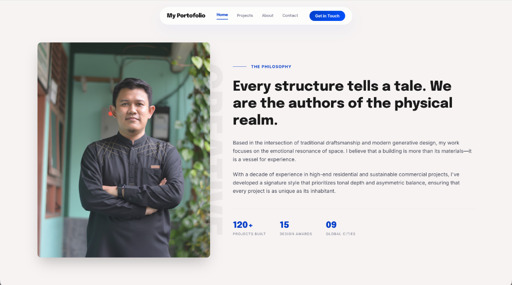

# My Portofolio

A sleek, modern, and editorial-style personal portfolio built with **Laravel 13**, **Livewire 4**, and **TailwindCSS v4**. It features a glassmorphism design, smooth interactions, and a fully functional admin panel to manage your projects, skills, experience, and site settings.



## Features

- **Public Frontend:** Home, Projects (with category filtering), About, and Contact pages.
- **Admin Backend:** Protected by authentication, built entirely with Livewire 4.
- **Dynamic Content:** Edit hero text, skills, experience, and projects directly from the admin panel.
- **Image Uploads:** Support for uploading local images for your portrait, contact section, and projects.
- **Contact Form:** Real-time validation and an admin inbox to view, reply, and manage messages.
- **Design System:** "Editorial Architect" theme with Inter & Epilogue fonts, Material Design icons, and custom glassmorphism utilities.

## Requirements

- PHP 8.2 or higher
- Composer
- Node.js & npm
- SQLite (default) or MySQL

## Installation

Follow these steps to set up the project locally:

**1. Clone the repository**

```bash
git clone https://github.com/eldorray/web-pribadi.git
cd web-pribadi
```

**2. Install PHP Dependencies**

```bash
composer install
```

**3. Install NPM Dependencies & Build Assets**

```bash
npm install
npm run build
```

**4. Set up the Environment File**

```bash
cp .env.example .env
php artisan key:generate
```

**5. Configure the Database**  
By default, the project uses SQLite. Create an empty SQLite file:

```bash
touch database/database.sqlite
```

_(Optional)_ If you prefer MySQL, update your `.env` file:

```env
DB_CONNECTION=mysql
DB_HOST=127.0.0.1
DB_PORT=3306
DB_DATABASE=your_database_name
DB_USERNAME=your_username
DB_PASSWORD=your_password
```

**6. Run Migrations & Seed Data**  
This will create the necessary tables and populate the site with sample data (including the default admin user).

```bash
php artisan migrate --seed
```

**7. Create the Storage Link**  
This is required so uploaded images can be displayed publicly.

```bash
php artisan storage:link
```

**8. Start the Development Server**

```bash
php artisan serve
```

If you need to compile frontend assets continually during development, also run:

```bash
npm run dev
```

## Admin Access

Once the server is running, you can access the admin panel at:
**URL:** `http://127.0.0.1:8000/login`

**Default Credentials:**

- **Email:** `admin@My Portofolio`
- **Password:** `password`

## License

This project is open-source software.
